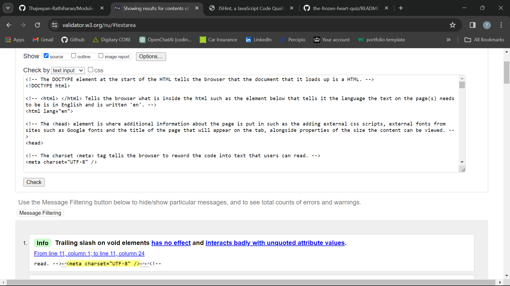
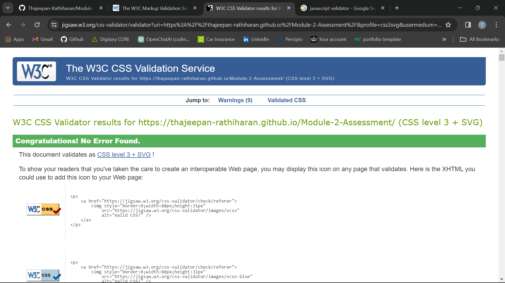
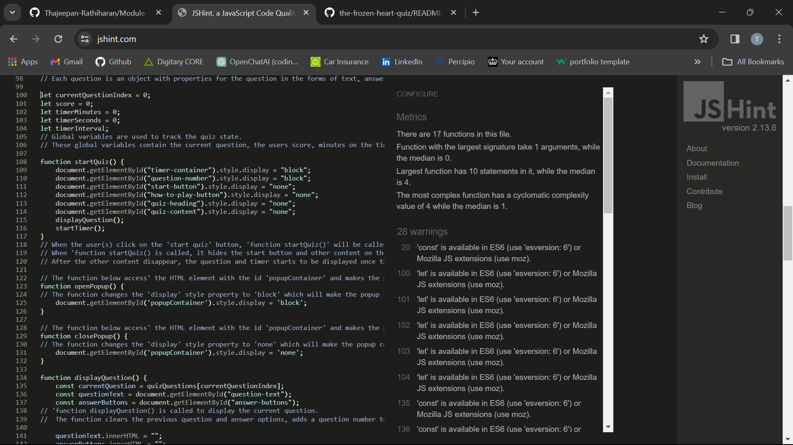
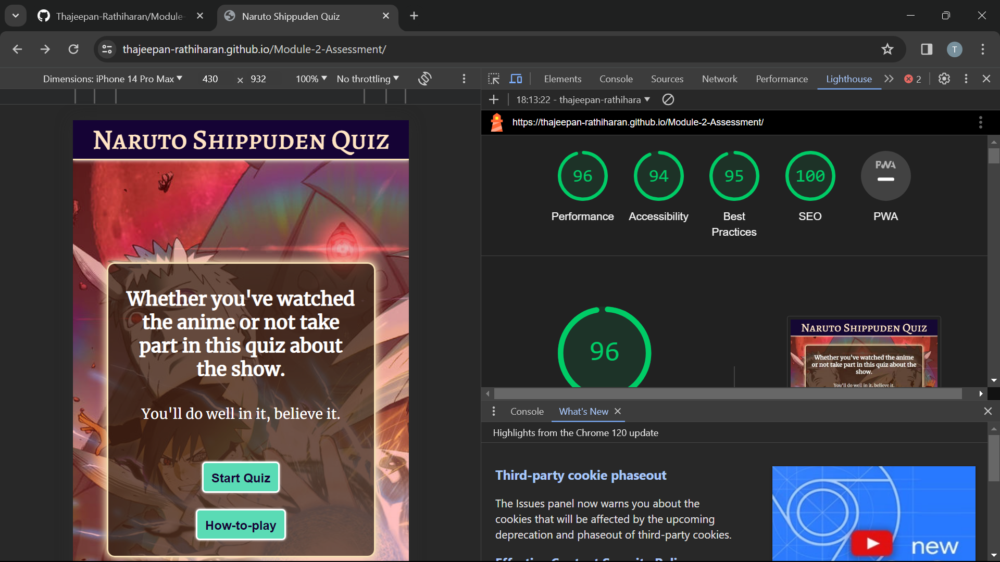
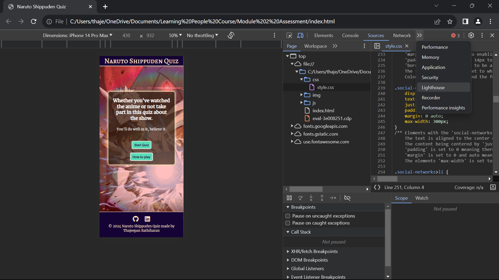

# Naruto Shippuden Quiz 

This quiz website is made for the project assessment for module 2 of the Front End Developer course, and it is to showcase on the knowledge I have gained from the lessons in the module about using JavaScript to enhance the websites I can make alongside HTML and CSS. On the other hand, this quiz is for anyone to participate in and test their knowledge about the anime Naruto Shippuden and if they aren't a fan they might even be intrigued with the show and want to watch it. 

## Usability

The site is responsive on both desktop and mobile devices.   
This can be seen with the @media screen resolutions stated on the css stylesheet that tell the browser the settings for each element depending on what the devices screen size is. So if the screen size is around 1025px or more, the content would be big and fit the screen. On the other hand if the screen size is around 600px or less, the content would be smaller on small screens but still be visible and readable due to the values given to the elements with the CSS properties given to those elements in the CSS stylesheet.

The quiz is easy to use as it starts once the user selects the 'start quiz' button and answers the questions, which there are 15 questions in total. Also at the end of the quiz it gives the user their result in a percentage format as well as telling them how many questions they got correct out of 15. Then there is a 'retry quiz' button that the user(s) can select if they want to try and get a better score which takes them to the home page of the quiz. If the user does not know how the quiz works, they can select the 'how-to-play' button and a popup appears that has a simple explanation of how the user would know how they know they got a question correct or wrong and how they can retry the quiz.

## Features of the site

* Feature 1 - Fully functioning quiz
* Feature 2 - Responsive design for desktop, tablet and mobile devices
* Feature 3 - Timer that counts how long is taken for the users attempt at the quiz once they press the 'start      quiz' button
* Feature 4 - Links to creators Github account and LinkedIn account

## Technology used

* Visual Studio Code was used as the code editor for this project.
* HTML is the coding language used to make the basic structure of the site via the headings, texts and images.
* CSS is used to style the HTML code of the website.
* JavaScript is used to make the site interactive.
* Git provides source control to commit and push code to the repository.
* Github is used to host live sites.
* FontAwesome is for website icons in the footer of the site.
* Favicon.io is used to create the website favicon. 

## Testing of the site

I tested my website using online tools such as: 
* [HTML WC3 Markup Validation Service](https://validator.w3.org/#validate_by_input)
* [CSS WC3 Markup Validation Service](https://jigsaw.w3.org/css-validator/)
* [JavaScript Validation Servce](https://jshint.com/)

### HTML WC3 Markup Validation Service

First the website was put through the [HTML WC3 Markup Validation Service](https://validator.w3.org/#validate_by_input) and it came back with no errors on the html validator.

### CSS WC3 Markup Validation Service

Then the website was also put through the [CSS WC3 Markup Validation Service](https://jigsaw.w3.org/css-validator/) and it came back with no errors on the css validator.

### JavaScript Validation Service

Finally the website was tested through the [JavaScript Validation Service](https://validator.w3.org/#validate_by_input) and it came back with no errors on the jshint validator.

### Performance check

Page loading times and performance of the quiz website was checked through the open source tool called 'Google Lighthouse'. 

The 'Google Lighthouse' tool is found by pressing Ctrl, Shift and I on the keyboard and pressing the '>>' sign and on the dropdown selecting 'Lighthouse'.

## Deployment

The website was deployed to Github in the following method:
  
1. Going to my GitHub repository on GitHub.
2. Clicking on "Settings" in my repository.
3. Clicking on "Pages"(tab on the left sidebar) in my repository.
4. Scrolling down to "Build and deployment"/"Source" section.
5. Find the sub-section "Branch".
6. From the drop-down menu "none"/"select branch" and choose source "main".
7. Click 'Save'.
8. Then waited until I saw a link for the deployed page within GitHub Page section. This can take a while. Once the page updates I got this message: Your site is live at https://thajeepan-rathiharan.github.io/Module-2-Assessment/.

## Credits

Font used for the quiz website was [Merriweather font](https://fonts.google.com/specimen/Merriweather?query=Merr) from Google fonts.

I got the questions and buttons layouts from the following [YouTube video](https://www.youtube.com/watch?v=WiLTsxjCmWQ&t=591s). 

The website's background image is from the game cover of ['Naruto Shippuden Ultimate Ninja Storm 4'](https://www.deviantart.com/maxiuchiha22/art/Naruto-Shippuden-Ult-Ninja-Storm-4-Wallpaper-1-798917740) without the text.